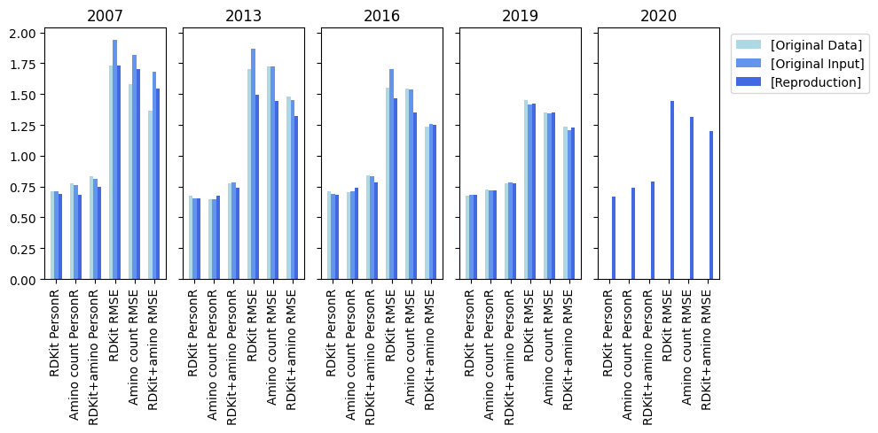

# PLBAffinity: Reproduction

## Abstract

This is a reproduction of [Protein-ligand binding affinity prediction exploiting sequence constituent homology](https://doi.org/10.1093/bioinformatics/btad502).

## Results

See [Table 1](results/table1.md "Table 1") for the underlying data.

## Overview

This repository contains three Jupyter notebooks:

- [prepare_input.ipynb](prepare_input.ipynb) for data preparation. This notebook reproduces the procedures described in the **Materials and Methods** section of the paper.
- [generate_output.ipynb](generate_output.ipynb) for prediction and estimation. The original R code has been rewritten in Python, based on the existing code in the [PLBAffinity](https://github.com/abbiAR/PLBAffinity) repository.
- [generate_figures.ipynb](generate_figures.ipynb) for creating tables and figures. This notebook compares the figures from the paper with the results of this reproduction.

## Deviations

This reproduction method has some deviations from the original paper:

- Python and Jupyter notebooks are used instead of R.
- Corrected values for NumRotatableBonds, confirmed with [PUG REST](https://pubchem.ncbi.nlm.nih.gov/docs/pug-rest).
- Train/Test split performed using a random seed (42) (split method not mentioned in the paper).
- Inclusion of the latest refined 2020 dataset from PDBbind.

## Reproduction

To reproduce the results, please follow these steps:

- Clone the [PLBAffinity](https://github.com/abbiAR/PLBAffinity.git) repository and place it in the same parent directory as this repository.
- Register a [PDBbind](http://pdbbind.org.cn) account if you haven't already.
- Set the `PDBBIND_USER` and `PDBBIND_PASS` global variables based on your PDBbind account.
- Adjust the `DATASET_YEAR` and `USE_ORIG_INPUT` variables in `prepare_input.py` and `generate_output.py`.

Please note: The notebooks need to be run for all possible configurations (2007-2020, with and without `USE_ORIG_INPUT`) in order to use `generate_figures.py`.

## Libraries

A few Python scripts are included to keep the code in the Jupyter notebooks concise:

- [src/dfcompare.py](src/dfcompare.py) to compare two pandas DataFrames and show the differences.
- [src/helper.py](src/helper.py) to manage file paths and create directories.
- [src/pdbbind.py](src/pdbbind.py) to easily download and access data from the PDBbind datasets.
